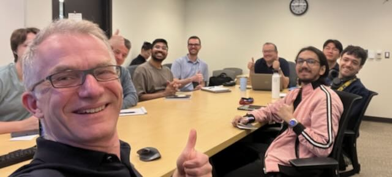
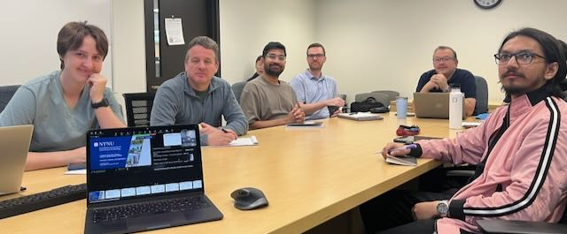

## Understanding what matters: UQSA in cardiovascular models

Seminar date: April 23, 2026

This seminar presents concepts, methods, and applications of uncertainty quantification (UQ) and sensitivity analysis (SA), with a focus on cardiovascular modeling.

## Topics covered

- uncertainty quantification and sensitivity analysis  
- variance-based methods such as Sobol indices  
- Monte Carlo and polynomial chaos approaches  
- applications to arterial and coronary flow models  
- reduced-order modelling for computational FFR  

## Slides

[Download slides as PDF](uqsa_umich_2026.pdf)

## Interactive material

[UQSA seminar hub](https://lrhgit.github.io/uqsa2025/)

::: {.columns}

::: {.column width="50%"}

:::

::: {.column width="50%"}

:::

:::

Leif Rune Hellevik  
Professor in Biomedical Engineering  
Norwegian University of Science and Technology (NTNU), Trondheim, Norway  
Visiting Scholar, University of Michigan, Ann Arbor  
April – July 2026  

